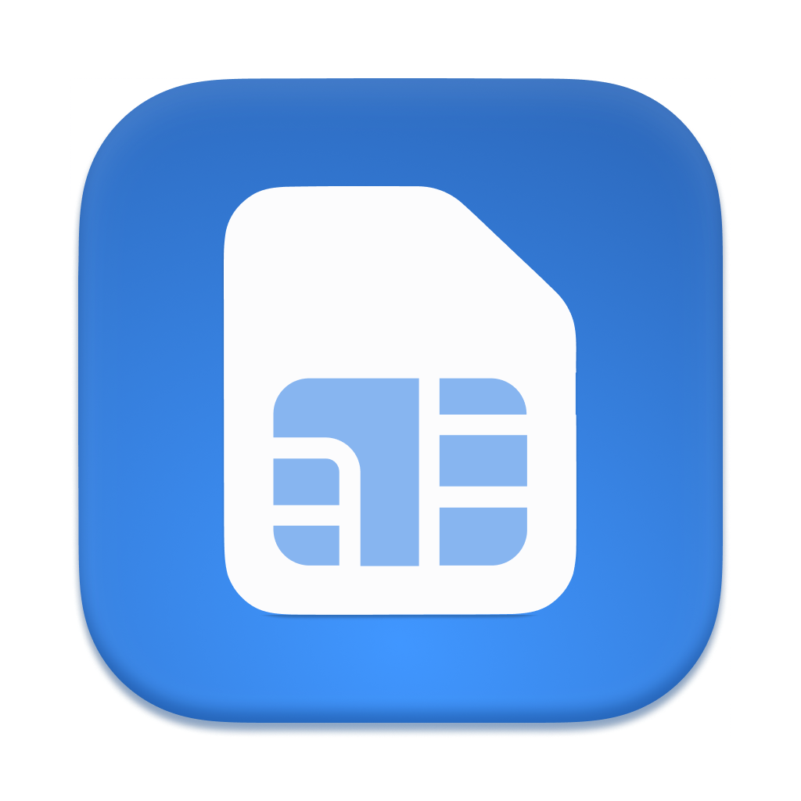
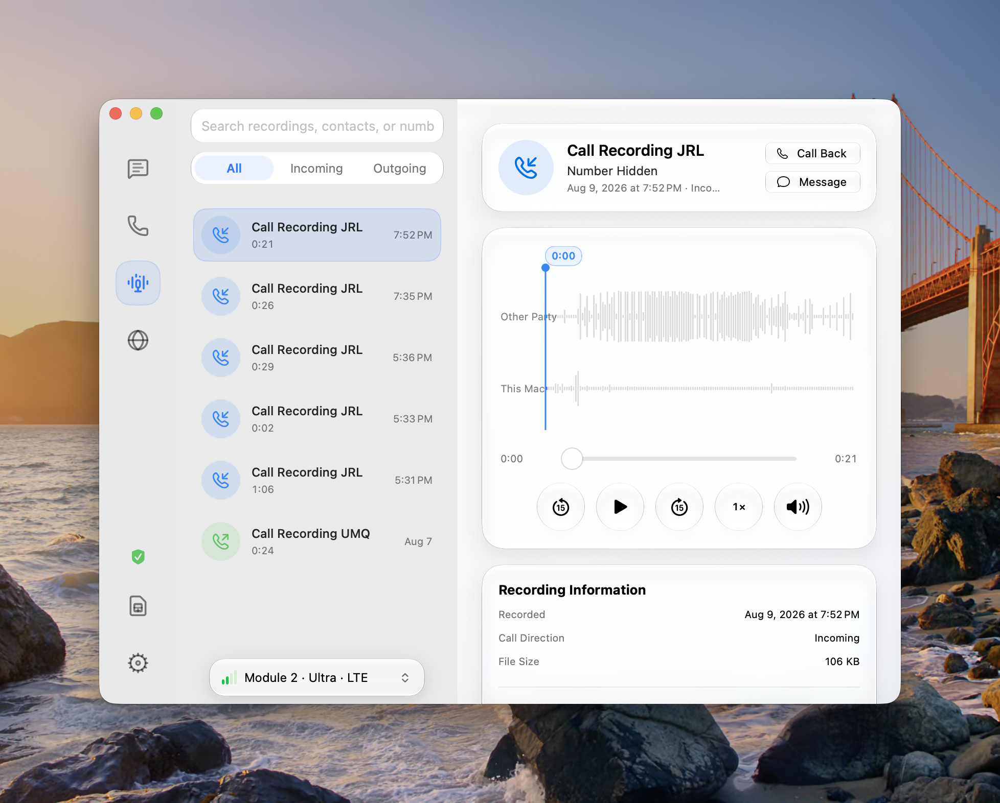

<p align="center">
  
</p>

<h1 align="center">CellDock</h1>

<p align="center">
  在 Mac 上使用蜂窝网络、短信和电话。
</p>

CellDock 是一款原生 macOS 菜单栏应用，用于连接 QDC507 蜂窝模组。插入模组后，
你可以直接在 Mac 上使用蜂窝网络、收发短信、管理通讯录、拨打电话、保存通话录音，
或把指定模组的蜂窝连接作为 SOCKS5 代理共享，无需浏览器服务或额外的通信软件。

## 主要功能

### 多模组与蜂窝网络

- 同时发现并监测多个受支持的 USB 蜂窝模组。
- 通信模组和上网模组可分别选择；同一时间只有一个模组作为系统的蜂窝优先出口。
- 每个模组可设为“蜂窝优先”“保持连接”或“关闭”；保持连接的模组可继续供绑定的
  SOCKS5 代理使用，但不会成为 macOS 的默认网络出口。
- 开启后自动让蜂窝网络优先于 Wi-Fi。
- 关闭后恢复原来的网络顺序，不影响短信和来电接收。
- 每个模组分别保存蜂窝网络开关状态；同一模组重新连接时恢复之前的选择。
- ECM 链路、DHCP 或模组重启异常时执行有边界的自动恢复。
- 实时显示运营商、网络制式、信号强度、IP 地址和连接阶段。
- 可选在菜单栏以固定宽度、上下两行显示实时下载和上传速度，默认关闭。

### SOCKS5 代理

- 为不同模组分别创建 SOCKS5 代理，让应用或局域网设备选择具体的蜂窝出口。
- 可仅监听本机，也可监听局域网；端口从 `1080` 起自动分配并可修改。
- 支持无认证和用户名/密码认证；局域网监听必须配置认证。
- 每个代理可独立启停，并显示连接数、模组离线、蜂窝网络关闭、链路中断或端口占用等
  运行状态。
- 代理绑定稳定的模组身份；模组重新插入后会重新解析网络接口。认证密码保存在 macOS
  钥匙串中。

> 局域网代理会把蜂窝出口开放给同一网络中的其他设备。请使用强密码，并确认本机防火墙
> 和所处网络可信。

### VoWiFi

CellDock 的 VoWiFi 只有一条通路：模组侧的 [`boa-z/vowifi-go`](https://github.com/boa-z/vowifi-go)
运行时通过 SOCKS5 代理把 IKEv2 与 ESP 送到运营商 ePDG。厂商 IWLAN 和 Android Telephony
后端已经移除——两者都无法被指向 SOCKS5 出口。

- “代理”页面的中间栏顶部提供“代理 / VoWiFi”两个标签页。
- CellDock 在 Mac 上开一个 **仅模组可达** 的 SOCKS5 中继：监听套接字绑定在 Mac 位于该模组
  ECM 链路上的地址，不会暴露给 Mac 所加入的其他网络；所有上游套接字固定绑定到所选出口接口。
- 出口默认取 macOS 的主 IPv4 接口（排除蜂窝模组自身），没有主接口时回退到任一持有地址的
  Wi-Fi 接口。可以再叠加一个支持 UDP ASSOCIATE 的上游 SOCKS5 代理。
- 逐模组显示运行阶段、数据平面、SIM/ISIM 鉴权、SOCKS5 UDP 关联、SWu/ePDG 隧道和 IMS 注册。
- 状态机 **不依赖模组侧 Wi-Fi**。走 SOCKS5 时模组本来就没有 WLAN 射频，任何以
  `wifi_connected` 为前提的判断都是错的。
- 运营商仍需为 SIM 号码开通 VoWiFi；ePDG、SIM/ISIM AKA 和 IMS 注册均由运行时完成。

#### 会话与一致性

`vowifi-go` 的 `SOCKSNATTTransport` 在 SOCKS5 关联断开后不会重拨，因此 CellDock 不尝试原地
修复，而是重建整个会话。每个会话带一个 `session` 令牌：

- 模组回报的 `session` 与本地中继不一致时，说明该运行时属于上一个 CellDock 进程，其 SOCKS5
  对端已不存在。CellDock 显示“运行时会话已失效”并自动停止/重建，而不是把它当成已注册。
- Mac 出口接口、模组 ECM 地址或上游代理路由发生变化时，中继身份随之改变，会话会被重建。
- 退出应用时会尽力停止模组上的运行时，避免留下指向已消失中继的死隧道。
- 轮询按状态自适应：过渡中 3 秒、已注册 20 秒、已停止 60 秒；固件不支持时完全停止轮询，
  以免持续争抢与语音共享的 ADB 控制通道。

#### 模组侧控制程序

控制程序可安装在下列任一路径：

```text
/usr/libexec/celldock-vowifi-go
/usr/bin/celldock-vowifi-go
/data/vendor/celldock/vowifi-go-control
```

`vowifi-go` 是供宿主程序调用的 Go 库，不是可直接运行的命令行程序，且采用 AGPL-3.0 许可证。
CellDock 不内嵌或改写其源码，只定义协议边界：宿主进程负责构造 `runtimehost.StartRequest`、
持有 `runtimehost.Instance`，并适配 QDC507 的 SIM/APDU/QMI、TUN 与 IMS 配置。

程序接受 `status`、`start`、`stop`。

`start` **从标准输入** 读取会话配置，不接受命令行参数——凭据出现在 argv 里会在运行时的
`/proc/<pid>/cmdline` 中长期可见：

```text
protocol=3
session=1f4b9c2ad0e34f6f9b1c7d2e5a8f0b31
dataplane_mode=userspace
proxy=socks5://vowifi:<一次性密码>@192.168.225.34:52001
```

`dataplane_mode` 只能是 `userspace`：`engine/swu` 在 `IKEPacketTunnelManager` 中明确拒绝
非用户态数据面的 SOCKS5 代理。IKEv2 与 ESP 必须共用同一个 UDP 关联，以保证 ePDG 看到
单一稳定的 NAT 映射。

`status` 使用控制协议 3，字段对应 `runtimehost.State`：

```text
protocol=3
supported=1
running=1
session=1f4b9c2ad0e34f6f9b1c7d2e5a8f0b31
phase=ready
dataplane_mode=userspace
sim_ready=1
access_ready=1
tunnel_ready=1
ims_ready=1
reg_status=200
last_error_class=-
last_reason=registered
```

`supported=0` 时用 `reason` 说明原因，取值为 `control-host-missing`、`sim-unavailable`
或 `dataplane-unavailable`。`phase` 对应 `runtimehost.State.Phase`
（`starting`/`sim_ready`/`ready`/`stopped`/`error`）。

错误输出必须预先脱敏，不得包含 IMSI、IMPI、IMPU、AKA 材料、nonce、密钥、APDU、IP/MAC
或私有路径。

### 短信

- 后台接收短信并发送 macOS 通知。
- 按会话查看完整短信，复制正文、回复或新建短信。
- 发送中文短信和长短信。
- 自动识别验证码，点击即可复制并标记已读。
- 短信记录标注来源模组；可在不同可用模组之间选择发送目标。
- 删除后不再出现在 CellDock；如果短信仍保存在模组中，CellDock 会同时尝试清理。
- 可选在验证码短信已读 30 分钟后自动删除。

### 电话与录音

- 拨号、接听、拒接、静音和挂断。
- 来电时显示带“接听”和“拒接”按钮的通知与浮窗。
- 通话中提供数字拨号盘，可操作客服语音菜单。
- 使用 Mac 的麦克风和扬声器进行通话。
- 保存最近通话与未接来电，并记录通话所使用的模组。
- 支持手动录音和经用户确认后自动录音，录制双方声道并保存为 M4A。
- 录音库支持波形、播放、跳转、倍速、音量、重命名、导出和在访达中显示。

> 使用通话录音前，请先取得通话参与者同意，并遵守所在地法律法规。

### SIM、eSIM 与通讯录

- 查看 SIM 状态、ICCID、IMSI、本机号码、运营商、网络制式和信号信息。
- 分别配置每个模组是否接收来电；需要重启模组的操作会明确提示。
- 自动识别物理 SIM 与 eUICC。
- 对受支持的 eUICC 查看 EID 和套餐，并可下载、启用、停用、重命名或删除 eSIM 套餐。
- 读取 macOS 系统通讯录，匹配短信与来电姓名。
- 在 CellDock 中新建、编辑、删除联系人和管理联系人分组。

### 菜单栏、声音与界面

- 支持模组热插拔，无需重启应用。
- 菜单栏图标显示通话、未接来电、未读短信、当前上网模组或可通话模组状态。
- 菜单栏面板按模组显示未读短信和未接来电；没有待处理内容时自动隐藏对应区块。
- 可自定义短信提示音和来电铃声；默认使用 `bleeps.wav` 与 `ring.mp3`。
- 支持简体中文、English、日本語和 Français，可在设置中即时切换。
- 支持跟随系统、浅色和深色主题。
- 演示隐私保护可隐藏联系人、号码、短信正文、验证码和录音标题。
- 可打开标准主窗口；关闭窗口后继续在菜单栏运行。
- 可选择模组未插入时隐藏菜单栏图标。
- 可选择登录 Mac 时自动启动，默认关闭。
- 内置稳定版和测试版更新频道，可自动检查或手动检查更新。

## 界面预览

点击任意截图可查看原图。

| 短信 | 电话 |
| :---: | :---: |
| <a href="screenshot/1. sms.png"></a> | <a href="screenshot/2. call.png"></a> |

| 通话中 | 通话中 |
| :---: | :---: |
| <a href="screenshot/2.1 calling.png"></a> | <a href="screenshot/2.2 calling.png"></a> |

| 录音 | 代理 |
| :---: | :---: |
| <a href="screenshot/3.records.png"></a> | <a href="screenshot/4. proxy.png"></a> |

| 设备 | 设置 |
| :---: | :---: |
| <a href="screenshot/5. device.png"></a> | <a href="screenshot/6. settings.png"></a> |

## 系统要求

- Apple Silicon Mac
- macOS 14 或更高版本
- QDC507 蜂窝模组
- 可用的 SIM 卡和对应运营商服务

CellDock 针对 macOS 26 的 Liquid Glass 界面进行了优化，在较早的兼容系统上会自动
使用标准 macOS 材质。

## 安装

1. 从 [GitHub Releases](https://github.com/moluncn/mavo/releases/latest) 下载最新的
   `CellDock-版本号-arm64.zip` 并解压。
2. 将 `CellDock.app` 放入下面任一位置：

   ```text
   ~/Applications/CellDock.app
   /Applications/CellDock.app
   ```

3. 当前 Release 使用 ad-hoc 签名，未经过 Apple 公证。仅当安装包来自上面的官方
   Release 页面时，根据应用所在位置运行下面一条命令，移除 macOS 下载隔离属性：

   ```sh
   xattr -dr com.apple.quarantine "$HOME/Applications/CellDock.app"
   ```

   或：

   ```sh
   xattr -dr com.apple.quarantine "/Applications/CellDock.app"
   ```

4. 双击打开 CellDock。

如果仍被 macOS 阻止，可在 Finder 中右键 CellDock，然后选择“打开”。不要对来源不明的
应用执行 `xattr` 命令。

## 首次使用

1. 插入模组，等待菜单栏出现信号图标。
2. 如果 CellDock 显示初始化引导，按照页面提示完成初始化。
3. 在“SIM 管理”中选择上网模组并打开蜂窝网络。
4. 第一次开启时，macOS 会要求一次管理员验证，用于安装 CellDock 网络组件。

网络组件安装完成后，以后切换蜂窝网络不再重复要求密码或 Touch ID，重新启动 Mac
后也仍然有效。

## 权限说明

CellDock 只会在需要时请求以下权限：

- **通知**：显示新短信和来电提醒。
- **麦克风**：进行语音通话。
- **通讯录**：识别短信与来电联系人，并在 CellDock 中管理系统联系人。
- **管理员验证**：首次安装网络组件，用于切换蜂窝网络和调整网络顺序。

该组件只允许操作 CellDock 识别到的目标模组，不能执行任意系统命令。

## 菜单栏与完全退出

关闭 CellDock 的主窗口不会退出应用，短信、来电和模组监测仍会在后台继续运行。

如果需要停止 CellDock，请打开“设置”，然后点击 **完全退出**。

## SIM 与 eSIM 说明

CellDock 会读取 SIM 中 EFMSISDN 保存的语音号码。如果运营商没有写入本机号码，界面会
明确显示 ICCID 尾号（SIM 卡序列号，并非手机号）。这不会影响联网、短信或电话功能。

eSIM 功能只会在检测到受支持的 eUICC 后显示。下载和启用套餐还取决于 eUICC、运营商
与套餐服务器是否兼容；删除套餐后通常需要重新从运营商获取激活信息。

## 数据与隐私

- 短信记录仅保存在当前 Mac：

  ```text
  ~/Library/Application Support/CellDock/messages.json
  ```

- 最近通话保存在：

  ```text
  ~/Library/Application Support/CellDock/calls.json
  ```

- 通话录音和录音索引保存在：

  ```text
  ~/Library/Application Support/CellDock/Recordings/
  ~/Library/Application Support/CellDock/recordings.json
  ```

- 用户导入的提示音会复制到：

  ```text
  ~/Library/Application Support/CellDock/Sounds/
  ```

- 已删除短信的屏蔽记录保存在同一目录，用于防止模块重新同步后再次出现。
- SOCKS5 代理配置保存在应用偏好设置中，认证密码单独保存在 macOS 钥匙串中。
- CellDock 不提供通信数据的云同步，也不会上传短信、号码、联系人或通话录音。
- CellDock 不会自动修改 IMEI，也不会刷机。

## 常见问题

### 插入模组后没有反应

拔下模组后重新插入，并退出可能正在占用模组串口、USB 或其他模组管理工具。如果仍未
识别，可在 CellDock 中点击刷新。

### 蜂窝网络已开启，但无法联网

确认 SIM 已开通数据服务并有可用流量，然后等待运营商分配网络地址。首次使用的
模组还需要完成 CellDock 初始化引导。

CellDock 会先确认 macOS 侧 ECM 链路已经激活，再启动 DHCP。如果网络服务已经启用但
ECM 链路仍处于 inactive，CellDock 会跳过无效的 DHCP 等待；无通话时最多自动重启一次
模组，让 CDC-ECM 重新枚举。链路正常但 DHCP 没有取得地址时，才会重置一次 DHCP
客户端。

### 菜单栏显示的是哪个模组

CellDock 按以下顺序选择菜单栏状态来源：

1. 蜂窝网络已开启时，显示当前上网模组。
2. 蜂窝网络关闭时，显示当前选择且可通话的通信模组。
3. 所选通信模组不可用时，显示第一个可通话模组。
4. 没有可通话模组时，显示列表中的第一个物理模组。

来电、通话、未接来电和未读短信图标会优先覆盖普通信号图标。未读短信和未接来电数量
是所有模组的汇总。

### 如何显示实时网速

打开“SIM 管理”，点击中间栏右上角的地球图标，在弹出菜单中开启“实时网速”。只有蜂窝
网络开启时才会显示；下载速度位于上方，上传速度位于下方。此选项默认关闭。

### “蜂窝优先”和“保持连接”有什么区别

“蜂窝优先”会把该模组设为 macOS 的优先网络出口，同一时间只能有一个；“保持连接”只
维持模组的 ECM 网络和地址，可供绑定到该模组的 SOCKS5 代理使用，不会改变系统默认
出口。切换蜂窝优先模组时，可以选择让原模组保持连接或完全关闭。

### 如何创建 SOCKS5 代理

打开主窗口中的“代理”，新建代理后选择绑定模组、监听范围、端口和认证方式，再开启并
保存。代理仅在对应模组在线、蜂窝网络处于“蜂窝优先”或“保持连接”且 ECM 链路正常时
运行。供本机软件使用时建议选择“仅本机”；选择“局域网”时必须设置用户名和
密码。

### CellDock 的运行日志在哪里

CellDock 使用 macOS 统一日志，不单独生成日志文件。可以在“控制台”应用中搜索
`CellDock`，也可以在终端实时查看网络日志：

```sh
log stream --info --style compact \
  --predicate 'subsystem == "app.celldock.mac" OR subsystem == "app.celldock.mac.network.helper"'
```

### 收不到短信或来电

确认 SIM 状态正常、运营商网络可用，并检查 macOS 通知权限。来电接收还需要在对应
模组的“SIM 管理”页面中开启。

### 为什么读不到手机号

很多运营商不会把本机号码写入 SIM。此时 CellDock 只能显示 ICCID 尾号用于区分 SIM；
ICCID 不是手机号，其他功能不受影响。

### 如何回复短信

打开短信右侧菜单并选择“回复”，或在短信详情窗口点击“回复”。CellDock 会自动填入
收件号码，但不会自动发送。

<details>
<summary><strong>开发者：从源码构建</strong></summary>

项目使用 Swift Package Manager，需要完整安装的 Xcode。

```sh
git submodule update --init --recursive
scripts/run_tests.sh
scripts/build_app.sh
```

构建完成后，经过签名和归档校验的应用位于：

```text
outputs/CellDock-<版本号>-universal.zip
```

正式版本必须同时递增 `CFBundleVersion`。本地或 CI 可以通过环境变量覆盖营销版本和
构建号：

```sh
CELLDOCK_VERSION=0.3.0 CELLDOCK_BUILD_VERSION=10 scripts/build_app.sh
```

应用通过 Sparkle 从以下两个更新源检查升级：

```text
https://celldock.app/stable/appcast.xml
https://celldock.app/beta/appcast.xml
```

Feed 源文件及安装包位于 `website/public/`，随网站静态资源一起部署到 Cloudflare
Worker。Sparkle 私钥保存在发布 Mac 的登录钥匙串中，账户名为
`app.celldock.mac`；仓库中只保存 `SUPublicEDKey` 公钥。

主要目录：

```text
Sources/CellDock/                     macOS 应用
Sources/CModemBridge/             USB AT 与语音桥
Sources/CUACProbe/                CoreAudio UAC 桥
Sources/CEuiccCore/               eUICC 桥与固定版本 libeuicc
Sources/CellDockNetworkIPC/           网络 helper XPC 协议
Sources/CellDockNetworkHelper/        受限网络 helper
Resources/Localization/           四语种本地化资源
Resources/ModuleVoice/            QDC507 通话运行资源源文件
Resources/Sounds/                 默认短信提示音与来电铃声
Tests/                            自测试
scripts/                          构建、打包与诊断脚本
```

普通测试不会自动拨号、发送短信、重启模组或修改模组配置。

</details>

## 鸣谢

特别感谢 [moluncn/mavo](https://github.com/moluncn/mavo) 项目。CellDock 在界面与功能设计上参考了 mavo，得益于原作者的开源工作，特此鸣谢。

## 许可证

CellDock 应用代码使用 [MIT License](LICENSE)。第三方组件及其许可证说明见
[THIRD_PARTY_NOTICES.md](docs/THIRD_PARTY_NOTICES.md)。
